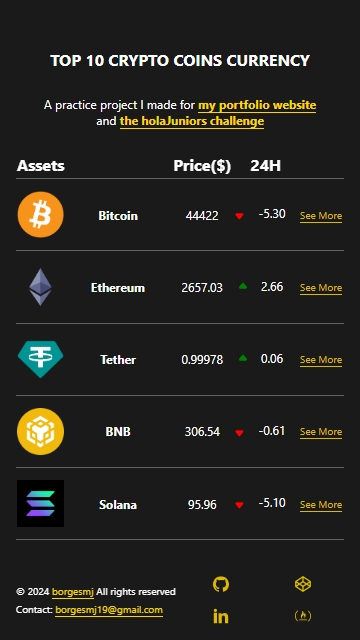
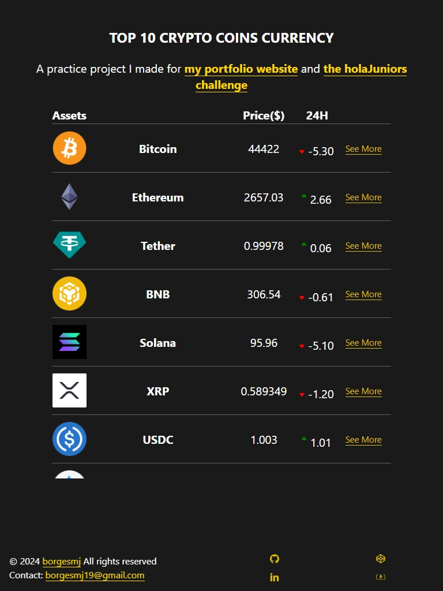
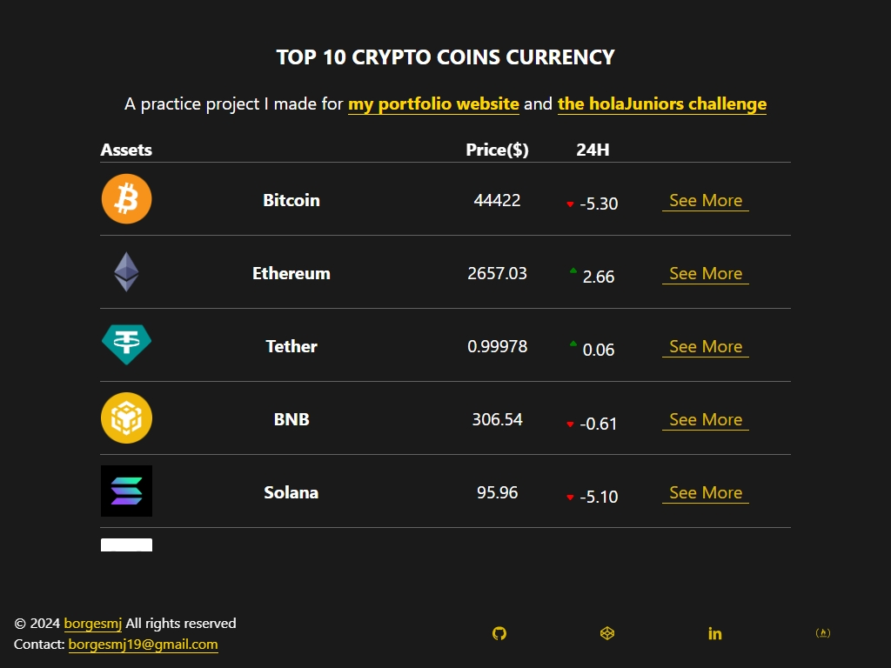

# HolaJuniors - Visualización en Tiempo Real de Criptomonedas
Desafío de programación de [HolaJuniors](https://holajuniors.com).

Nuestros desafíos te ayudan a mejorar tus habilidades de programación mediante la creación de proyectos realistas.

## Requerimientos del proyecto: [Visualización en Tiempo Real de Criptomonedas](https://holajuniors.com/challenges/visualizacion-en-tiempo-real-de-criptomonedas)

Imagina que te encuentras inmerso en el fascinante mundo de las criptomonedas, y se te ha encomendado la tarea de presentar las 10 criptomonedas más importantes del mercado en tiempo real.

Para eso puedes utilizar la API: https://api.coingecko.com/api/v3/coins/markets?vs_currency=usd&per_page=10

O sientete libre de utilizar la que más te guste.

A continuación, se detallan los pasos que deberás seguir:

1. Integración con la API:
Conecta tu aplicación a la API proporcionada para obtener datos actualizados sobre las criptomonedas en tiempo real.
Asegúrate de manejar adecuadamente las solicitudes a la API y gestionar posibles errores.

2 . Presentación de datos en una tabla:
Diseña una interfaz que presente la información de las 10 criptomonedas más importantes de manera clara y organizada.
Muestra detalles relevantes, como el nombre, símbolo, precio actual y cambios recientes.

3. Actualización automática de datos (opcional):
Implementa la funcionalidad para actualizar automáticamente los datos de la tabla a intervalos regulares, reflejando la dinámica cambiante del mercado de criptomonedas.

## Stack utilizado

## Screenshots y vista previa
### Version mobile

### Version tablet

###Version Desktop

## Instalación
1. Clona el repositorio
`git clone https://github.com/borgesmj/crypto-curr.git` 
2. Instala dependencias
`npm install`
3. Corre el proyecto
`npm run dev`

## Licencia
[MIT](https://choosealicense.com/licenses/mit/)
La mayoría de los proyectos de código abierto utilizan la licencia MIT. Siéntete libre de elegir la licencia que prefieras